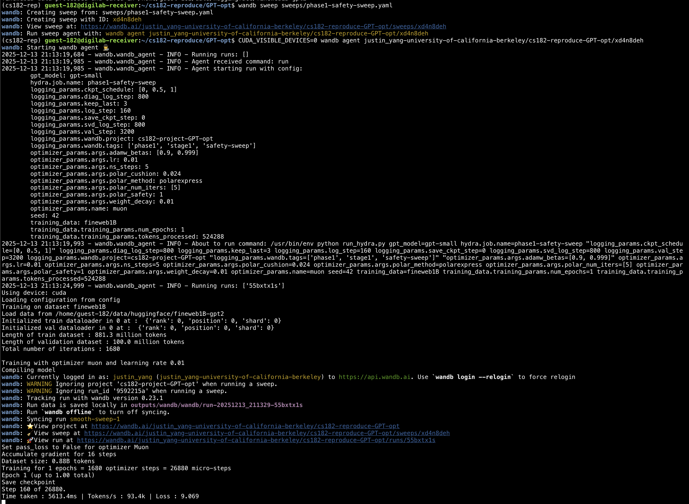

# Riding the Polar Express to Convergence: Getting Attention on the Track to Stability
Follow the steps below to reproduce the results presented in our main paper.

### Environment setup

Install [miniconda](https://www.anaconda.com/docs/getting-started/miniconda/install), then run the following commands
```bash
# 1. Create a conda environment
conda env create -f environments.yaml
conda activate cs182-rep

```
[optional] Add the following to the end of your .bashrc file to enter this environment automatically upon shell creation: `conda activate cs182-rep`

# Steps to Running Code

Start by changing directories to the `GPT-opt` directory:
```bash
cd GPT-opt
```

## Step 1: Download the fineweb dataset
Next, define the `DATA_DIR` environment variable. This defines where the FineWeb1B dataset will be stored.

```bash
export DATA_DIR = "absolute/path/to/data/dir"
python3 process_data.py --name fineweb1B
```

## Step 2: Login to wandb
Run `wandb login` to login to your wandb account.


## Step 3: Run a sweep
Execute the following sequence of commands to run a simple sweep.
NOTE: Your GPU must have at least 20 GB of VRAM to execute all the runs without Out-of-Memory Errors
```bash
# Create a new wandb sweep
wandb sweep sweeps/phase1-safety-sweep.yaml
# Run the sweep command 
CUDA_VISIBLE_DEVICES=0 wandb agent your/wandb/sweep/id
```
As an example, your command should look like the following:
```bash
CUDA_VISIBLE_DEVICES=0 wandb agent justin_yang-university-of-california-berkeley/cs182-project-GPT-opt/2jfn4wyv
```

The Figure below depicts a successful initiation of a run:


# Reproducing Plots

## Download data [if you want to use your own sweep data]
Download your custom wanb sweep data to a local computer using the notebook
`plotting/download-data.ipynb`

## Generate plots [use our included data]
If you are using your own data, within the notebook, there are code cells explaining how to establish sweep name mappings to the wandb unique `sweep_id`.

The data we got from our sweeps is provided to you in the `plotting/data` folder.

To create the plots, run this notebook:
`plotting/analyze-data.ipynb`

The notebook is set up for the cells to be run in order using our data.
